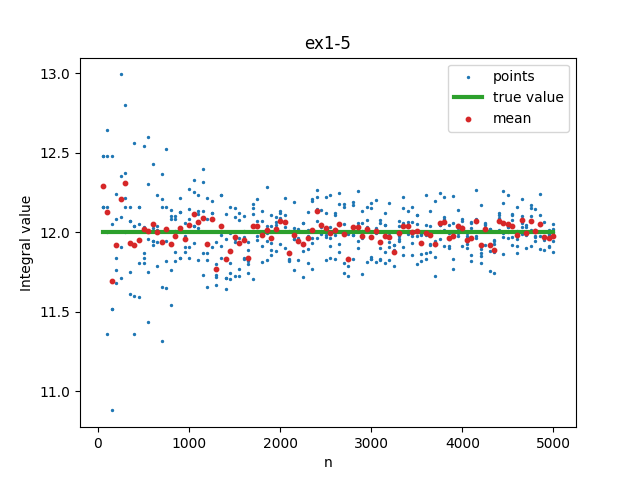
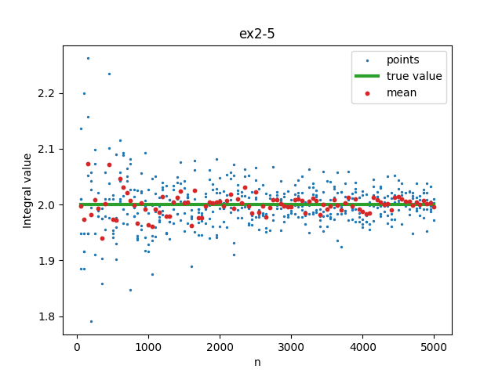
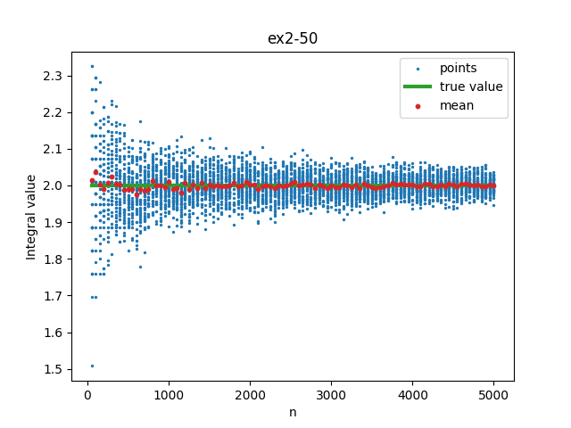
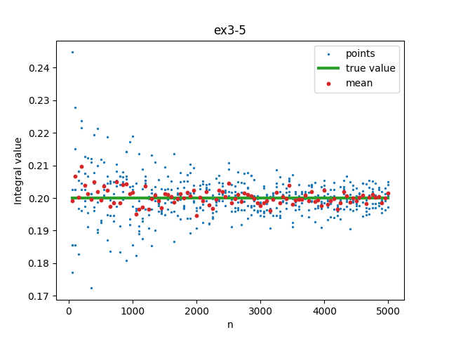
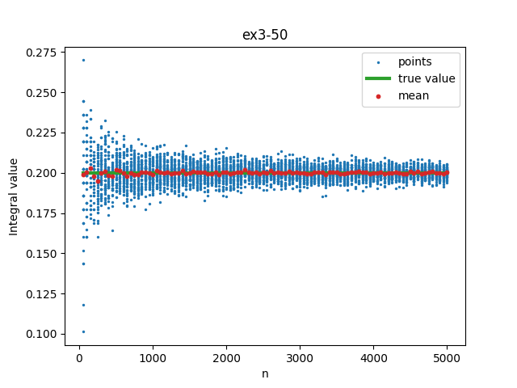

# MPiS Zadanie domowe 1
Manfred Gawlas

### Parametry symulacji
Do symulacji wykorzystano generator Mersenne Twister, którego implementacja pochodzi z Wikipedii. Seed został ustalony, zgodnie z polecieniem z Wikipedii, na:
```cpp
uint32_t seed = 19650218UL;
```
Przeprowadzono również testy z seedem `529508UL`.

### Wyniki
Wykresy przedstawiają kolejno wyniki obliczeń dla następujących całek:
 - ex1 dla $\int^8_0 \sqrt[3]{x} \, dx$
 - ex2 dla $\int^\pi_0 \sin(x) \, dx$
 - ex3 dla $\int^1_0 4x(1-x)^3 \, dx$

Liczby 5 i 50 oznaczają odpowiednio liczbę niezależnych powtórzeń symulacji.










### Wnioski
Wszystkie wykresy charakteryzują się dwoma rzeczami:
1. Przy niższych wartościach \( n \) dla 50 niezależnych powtórzeń na wykresach pojawiają się poziome linie, pomiędzy którymi można zaobserwować coś przypominającego kształt hiperboli.
2. Pole wyznaczone przez niebieskie punkty zdaje się być z góry ograniczone przez funkcję $\exp(-x)$, natomiast z dołu przez $-\exp(-x)$.

#### Wniosek 1
Pierwszy efekt prawdopodobnie wynika z pseudolosowego charakteru generowania liczb przez Mersenne Twister. Układ ten jest konsekwencją właściwości generatora i wydaje się być niezależny od wyboru seedu.

Testy z seedem `529508UL` wykazały te same zależności co dla `19650218UL`. 

#### Wniosek 2
Aby zweryfikować to stwierdzenie, użyto biblioteki scipy do przeprowadzenia regresji logarytmicznej na danych. Następnie wyznaczono współczynnik korelacji Pearsona pomiędzy uzyskaną funkcją a zbiorem punktów.


Correlations: 0.9131934515017235, 0.9292631099081725, 0.8892892111118273
Mean: 0.9105819241739077

Wysokie współczynniki korelacji wskazują na słuszność wyciągniętego wniosku.

#### Podsumowanie
Z symulacji wyciągnięto dwa główne wnioski. Po pierwsze, zauważono pseudolosowość algorytmu poprzez wizualną obserwację powtarzających się wzorców na wykresach. Po drugie, na podstawie wyników z 50 powtórzeń sformułowano teorię o ograniczeniu wyników przez odwróconą funkcję wykładniczą, co potwierdzono przy pomocy analizy statystycznej.
