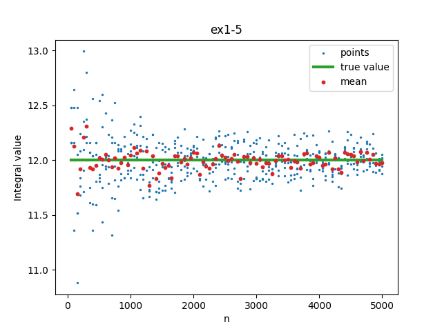
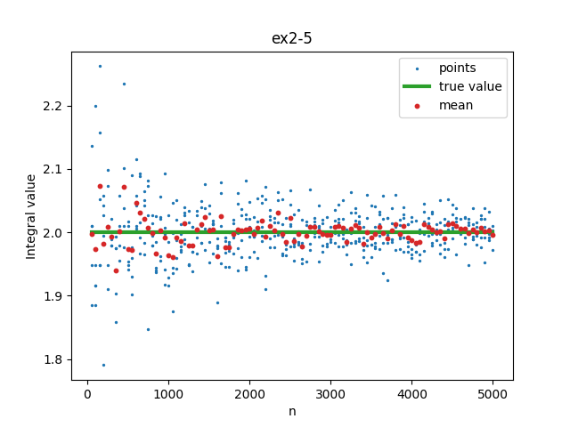
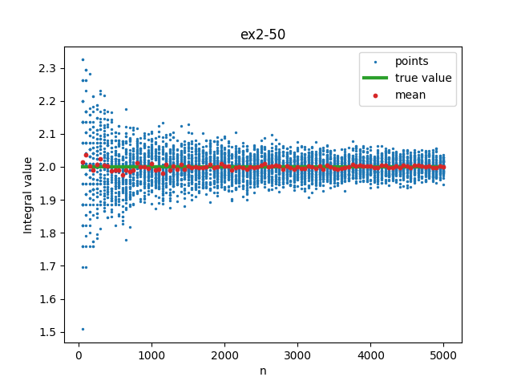
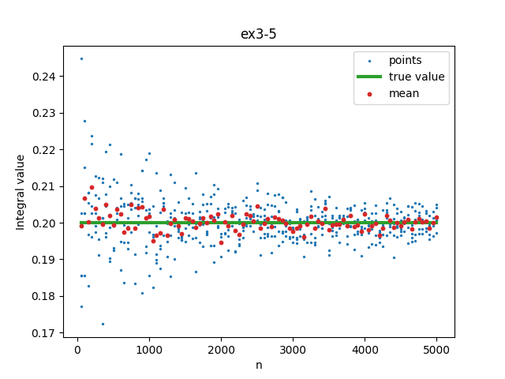
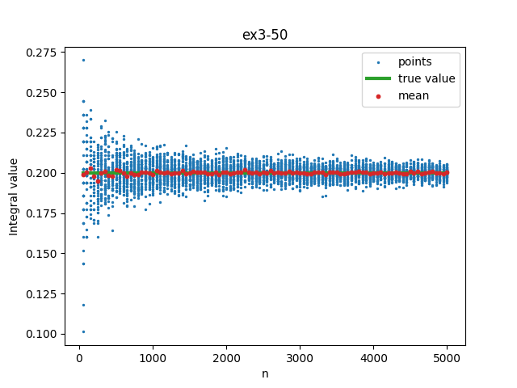
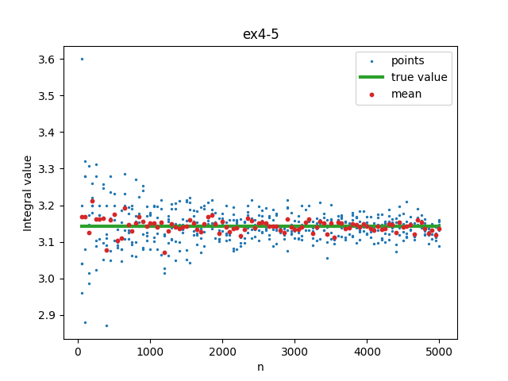
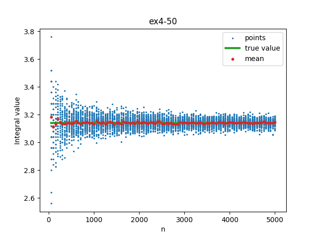

# MPiS Zadanie domowe 1
Manfred Gawlas

### Parametry symulacji
Do symulacji został wykożystany generator Mersenne Twister, jego implementacja wzięta z wikipedii. Seed był twardo wybrany na:
```cpp
uint32_t seed = 19650218UL;
```
Sprawdzono też dla seedu `529508UL`.

### Wyniki
Wykresy są po kolei:
 - ex1 dla $\int^8_0\sqrt[3]{x}dx$
 - ex2 dla $\int^\pi_0sin(x)dx$
 - ex3 dla $\int^1_0 4x(1-x)^3dx$

Gdzie 5 i 50 oznaczają liczbę niezależnych powtórzeń.













### Wnioski
Wszystkie wykresy charakteryzują się dwoma rzeczami:
1. Dla niskich wartości n przy 50 niezależnych wartościach powstają poziome kreski, pomiędzy którymi można zaobserwować coś co jest podobne do hiperboli.
2. Pole będące pod niebieskimi kropkami zdaje się być od góry ograniczone przez $\exp{-x}$, zdołu analogicznie przez $-\exp{-x}$.

#### Wniosek 1

Gdzie pierwszy punkt musi być spowodowany sposobem w jaki Mersenne Twister generuje liczby losowe, widać tutaj pięknie że ten rozkład jest tylko pseudolosowy. Kształt ten też zdaje się być niezależny od seed'u.

Wyniki dla seedu `529508UL` zachowywały te same zależności co dla `19650218UL`. 

#### Wniosek 2
By ocenić to stwierdzenie użyto biblioteki scipy do regresji logarytmicznej na tym zbiorze. Następnie wyznaczono wspólczynnik korelacji Pearsona pomiędzy otrzymaną funkcją a zbiorowi punktów.


Correlations: 0.9131934515017235, 0.9292631099081725, 0.8892892111118273
Mean: 0.9105819241739077

Współczynniki korelacji są wysokie i jawnie wskazują na poprawność wyciągniętego wniosku.

#### Podsumowanie
Z symulacji wyciągnięto dwa wnioski, po pierwsze zauważono pseudolosowość algorytmu poprzez wizualne zauważenie powtarzającego się wzorca na wykresach. Po drugie na podstawie badań z 50 cioma powtórzeniami wysnuto teorie o względnym ograniczeniu wyników poprzez odwróconą eksponente, którą następnie potwierdzono.
