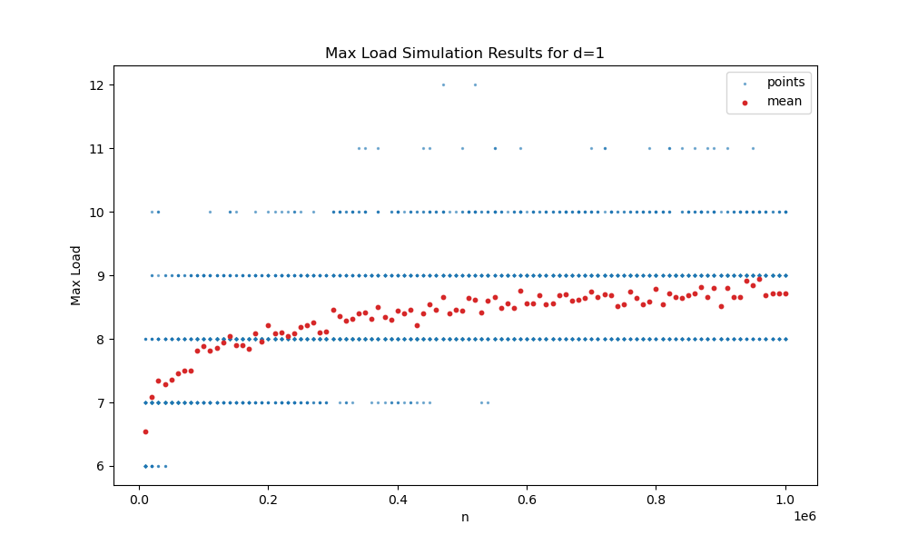
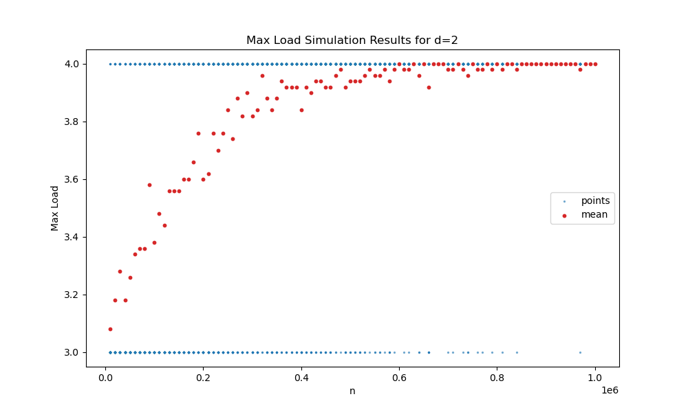
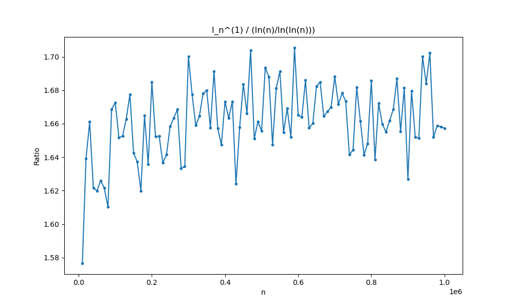
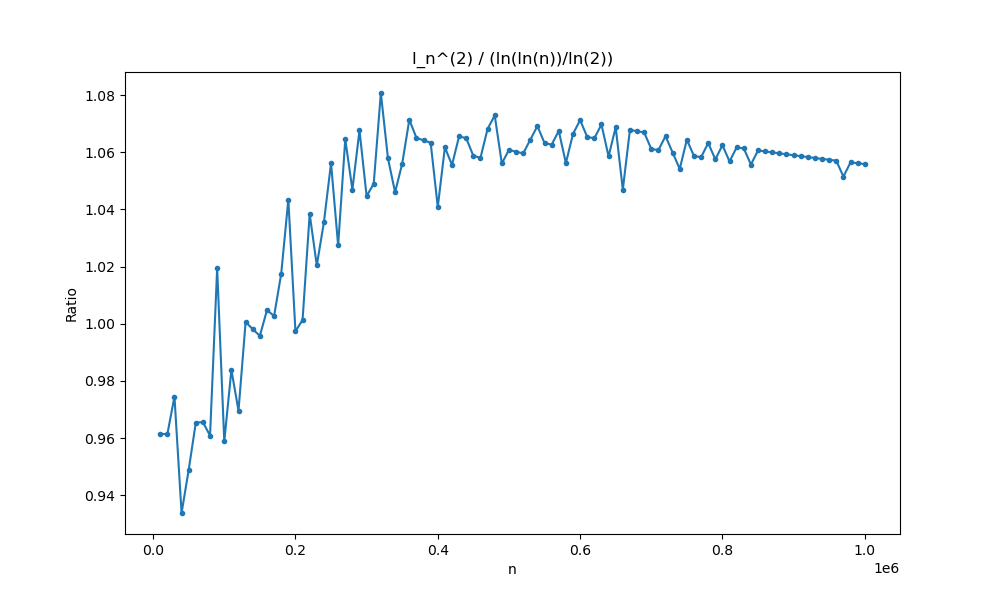
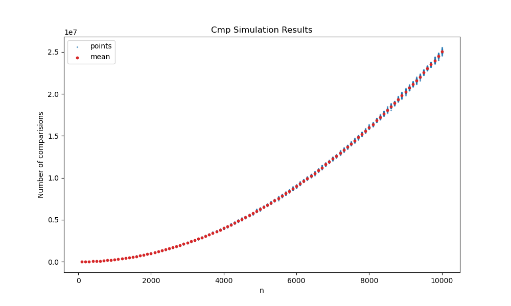
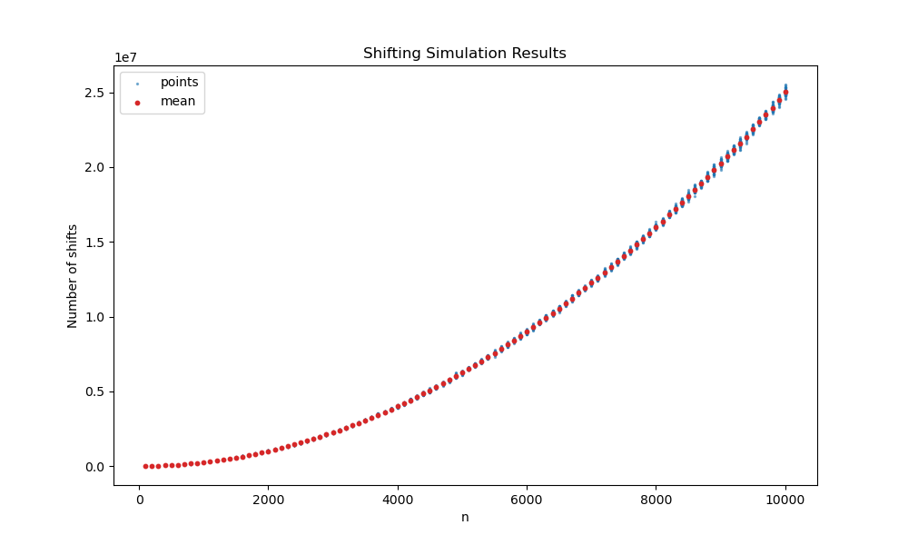
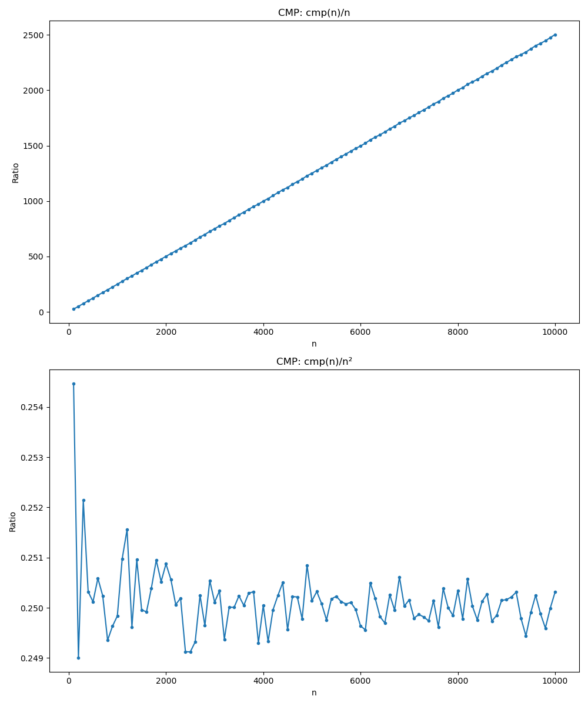
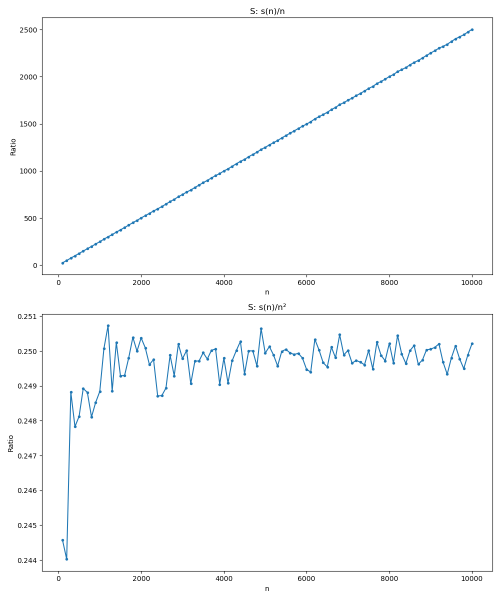
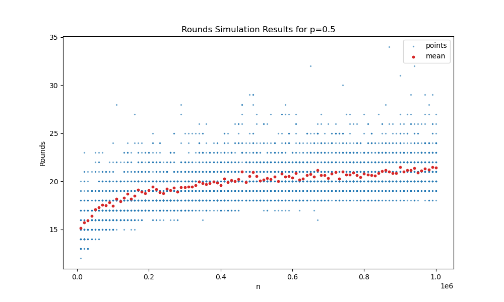
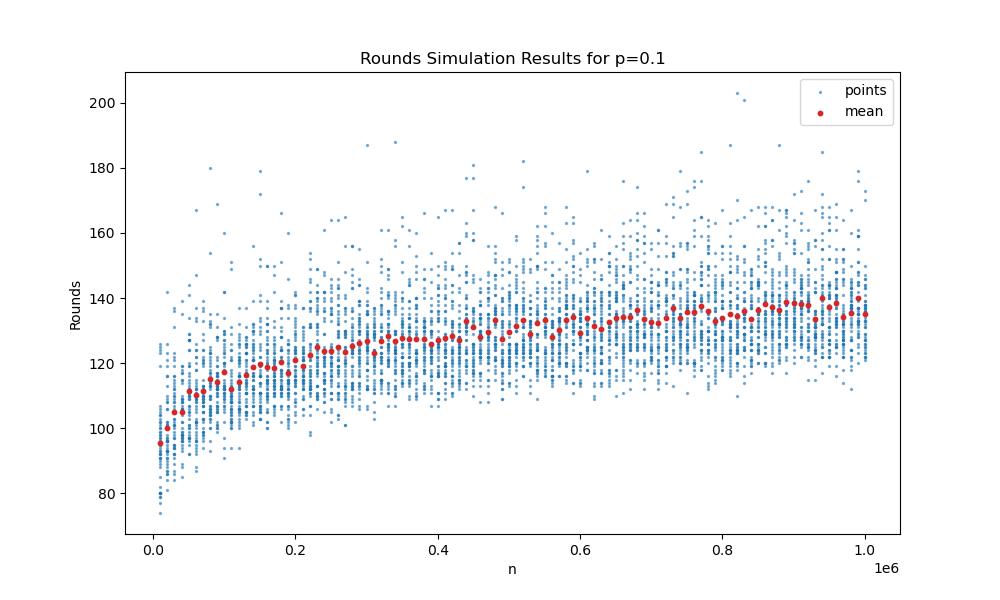

# MPiS Zadanie domowe 3
Manfred Gawlas

### Parametry symulacji
Do symulacji wykorzystano generator Mersenne Twister, którego implementacja pochodzi z Wikipedii. Seed został ustalony, zgodnie z polecieniem z Wikipedii, na:
```cpp
uint32_t seed = 19650218UL;
```
Program był 4 wątkowy, bo tyle wątków mój komputer obsługuje. 

Bardzo przepraszam za spóźnione wysłanie, szczerze powiedziawszy to sobie na ostatnią chwile zostawiłem, bo robiłem sporo innych ciekawych rzeczy(nauka nixa, haskella i dokumnentacja na zawody z koła) a zaraz po sylwestrze się rozchorowałem.

## Zadanie 1
Maksymalne zapełnienie kubła jako funkcje n dla d=1 oraz d=2




Jak widać na wykresach, w obu przypadkach koncentracje są dosyć ciekawe, co jest spowodowane bardzo ograniczonym zbiorem możliwych sensownych outputów. Dziwne by było oczekiwać dużych rozbiegów dla d=2 przy tak dużych liczbach i sytuacji gdzie wartości outputowane są intami, a średnia mieści się w [3, 4]. 

Dla d=2 w szczególności widać jak mocna jest koncentracja, gdzie dla 8e5 mamy praktycznie tylko kilka przypadków gdzie wartość jest różna od 4.

Koncentracja dla d=1 zdaje się być mniejsza, gdzie w przypadku dla d=2 nie mamy ani razu 5, a 5 jest bliżej 4 procentowo niż 12 do 8,5.

### Asymptotyka




Patrząc na asymptotyki z wykresów, zdaje się że $l_n^{(1)}$ jest rzeczywiście 
$$O\left(\frac{\ln{n}}{\ln{\ln{n}}}\right).$$
Ciężko to akurat powiedzieć dla drugiego przypadku, czyli dla porówniania $l_n^{(2)}$ z
$$O\left(\frac{\ln{\ln{n}}}{\ln{2}}\right).$$
Nie koniecznie oznacza to że $l_n^{(2)}$ nie jest tej asympototyki, problem jest tylko z tym jak wolno ta funkcja rośnie i że rozkład jest dyskretny i to na inty z zakresu [3, 4], a więc wiele informacji jest tracone ze względu na to jak bardzo dyskretny jest output.

## Zadanie 2
Implementacja insert sort'u została zrobiona tak jak w Cormen'ie. W jej przypadku już na początku można napisać oczekiwane złożoności czasowe, dlatego że wsumie je znam ale też odrazu się narzucają. W najlepszym przypadku(dla posortowanej tablicy) złożoność to O(n). W najgorszym i średnim złożoność to O(n^2). Jest to dosyć oczywiste, w złych przypadkach musimy porównać za każdym razem z każdym elementem w lewej ręce, a więc:
$$1 + 2+ 3 + 4 + .. + n = \frac{n(n-1)}{2} = O(n^2)$$ Przestawień jest tyle samo.

Mam nadzieję że s, czyli zapewnie shift to mamy namyśli przestawienie elementu w tablicy, wtedy ich jest praktycznie tyle samo co CMP, a nie tak jak w Cormanie wsadzeń karty z prawej ręki to listy kart w lewej. Wtedy to będzie trywialne O(n).



Jak widać na wykresach, rozrzut jest niski i rośnie wraz z n.

### Asymptotyka



W jawny sposób jest to O(n^2). Relatywne skoki na początku są nieznaczące, tymbardziej jak się zwróci uwagę na ich względną wielkość. Są zapewne spowodowane małą ilością losować, przez co wynik może bardziej zależeć od "losowości" i nie będzie się wypłaszczał.

## Zadanie 3
Tutaj taką pierwszą obserwacją jest to że wraz z n wynik powinien rosnąć, ale pochodna powinna się zmniejszać. Co do dokładnej złożoności czasowej, ciężko mi podać dokładnie z głowy co to może być za funkcja. Napewno będzie rosnąć, bo im więcej stacji tym większe prawdopodobieństwo że po $p$ próbach nadal którejś wylosuje się nadal kaplica.
Ogólnie można zapisać że prawdopodobieństwo że po $p$ próbach jedna stacja nie odbierze jako:
$$f(p) = (\text{1-probability})^p$$
Gdzie probability to że odbierze. Więc prawdopodobieństwo że odbierze można wyrazić sumą lub poprostu
$$\text{connect}(p) = 1 - (\text{1-probability})^p$$
Prawdopodobieństwo że wszystkie się połączą, a więc n maszyn to n iloczynów a więc:
$$\text{connect}(p, n) = (1 - (\text{1-probability})^p)^n$$
Stąd widać już że funkcja że wszystkie sie połączą od n będzie logarytmiczna. 




Jak widać na wykresach, prawdopodobieństwo ma znaczący wpływ na liczbę potrzebnych rund. Ponad to funkcja tak jak zakładano jest logarytmiczna(lub przynajmniej taka się zdaje).


