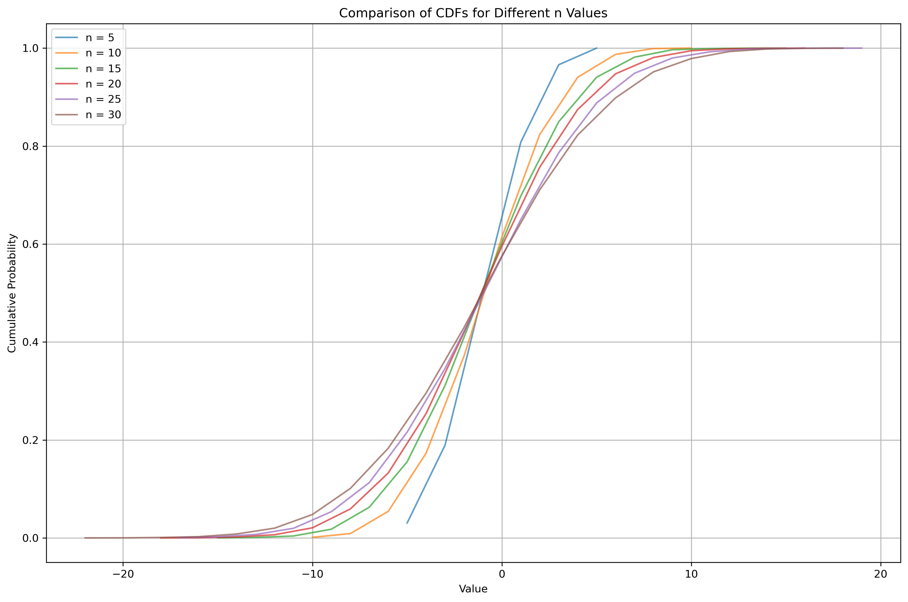

# MPiS Zadanie domowe 1
Manfred Gawlas

### Parametry symulacji
Do symulacji wykorzystano generator Mersenne Twister, implementacja wykożystana z biblioteki [System.Random.Mersenne.Pure64](https://hackage.haskell.org/package/mersenne-random-pure64-0.2.2.0/docs/System-Random-Mersenne-Pure64.html).

This is pure functional implementation of RNG.

Program napisano w Haskell'u. Za to się spóźniłem z wysłaniem, w piątek wieczorem skończyłem symulacje, sobota rano robie teraz dokumentacje.

## Zad1 - Nierówno´sci ogonowe dla rozkładu dwumianowego Bin(n, 1/2)

Niech $X \sim \text{Bin}(n, \frac{1}{2})$. Zastosowano nierówności Markowa oraz Czebyszewa do oszacowania:  

(a) $P(X \geq 1.15 E(X))$
(b) $P(|X - E(X)| \geq 0.1 E(X))$

Do obliczenia dokładnych wyników, zastosowano biblioteke statistics:
```hs
import Statistics.Distribution.Binomial
```


### Wyniki  

#### (a) Oszacowanie \( P(X \geq 1.15 E(X)) \)  

| \( n \)   | Ograniczenie Markowa | Ograniczenie Czebyszewa | Wartość dokładna |
|----------|---------------------|-----------------------|-----------------|
| 100      | 0.8696              | 0.00756               | 0.09667         |
| 1000     | 0.8696              | 0.000756              | 0.00000118      |
| 10000    | 0.8696              | 0.0000756             | 0.0             |

#### (b) Oszacowanie \( P(|X - E(X)| \geq 0.1 E(X)) \)  

| \( n \)   | Ograniczenie Markowa | Ograniczenie Czebyszewa | Wartość dokładna |
|----------|---------------------|-----------------------|-----------------|
| 100      | 10.0                 | 1.0                   | 0.3682          |
| 1000     | 10.0                 | 0.1                   | 0.00173         |
| 10000    | 10.0                 | 0.01                  | 0.0             |

### Wnioski
#### Dokładność oszacowania:
- Jak widać, bardziej dokładne oszacowanie daje Ograniczenie Czebyszewa, które co ciekawe, w przypadku (a) dla n = 100 daje wynik mnijeszy o rząd wielkości od wartości dokładnej.
- W obu przypdakach ograniczenie Czebyszewa dokładniejsze od rzędy wielkości.
#### Charakterystyka oszacowań
Dla obu ograniczeń widać bardzo proste zależności. Ograniczenie Markowa jest constst względem n oraz ogranicznie Czebyszewa maleje proporcjonalnie do n. Jest to oczywiście oczekiwane, ze względu na to jak one się wyrażają.

## Zad2 - Błądzenie losowe na liczbach całkowitych

### Wyniki



### Wnioski
Jak widać, wyznaczone dystrybuanty są bardzo podobne z dystrybuantą rozkładu normalnego który aproksymuje $S_n$. 

Zależność pomiędzy różnymi CDF dla różnych n też pokazuje że wsumie jest to z grubszda rozciąganie tego samego efektu.

Dla n=100 mamy prawie perfekcyjnie pokrywające się warotści empiryczne z teorytycznymi.

## Zad3 - Błądzenie losowe na $\mathbb{Z}$ – rozkład „czasu spędzonego nad osią OX”

### Wyniki


### Wnioski
Po pierwsze, warto zauważyć że zwiększenie n z 100 na 1000 zauważalnie poprawia zależność między histogramem a PDF dla arcsinusa.

Ale co ważniejsze, to widać bardzo ciekawą zależność. Jest bardzo bardzo wysokie prawdopodobieństwo że proces spędzi prawie cały czas nad lub pod osią. Dla zakresu [0.2, 0.8] wartość prawdopodobieństwa jest niska, ale dla [0, 0.2] i [0.8, 1.0] mamy wystrzał w kosmos.

Takie moje przeczucie dlaczego tak jest, to że nawet jak mamy jakieś 50-50 -1 i 1, to żeby spędzić po równo czasu nad i pod to by trzeba było bardzo charakterystycznie uporządkować te 1 i -1, dokładnie tak, by po ciągu iluś -1 następował 2 razy większy ciąg 1, i potem tej samej wielkości ciąg -1 itd. Jak będziemy mieli jakieś zanieczyszczenia w tym ciągu, to tym bardziej będzie poprostu bardziej wypłaszczona trasa nad czy pod.

